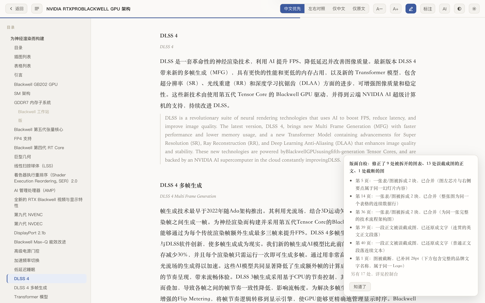

<div align="center">

# paper-lens

**中英对照读论文,公式原样保留,AI 助教就在旁边。**

拖入 PDF,得到一份中英对照的阅读器,每个公式、表格、插图都保持原始排版。点公式让 AI 讲解,划选任意文字继续追问。

全程在浏览器里完成,无后端,无构建,文件不上传。

[English](README.md)


</div>

---

## 为什么做这个

起因是要精读一篇 85 页的金融/机器学习论文,现有方案各有各的问题。

**机器翻译会把数学毁掉。** 这不是质量问题,是结构问题。PDF 里没有"一个公式"这种概念,它只存字形和坐标。把矩阵的文本抽出来是这样:

```
0.2880.4130.8991.057
```

表格更糟:

```
High(H)40.020.61.9443.620.42.14225.819.31.34...
```

任何试图从文本流重建公式的方案都建在沙子上。把这串东西拿去翻译,数学就没了。

**光翻译不解决真正的问题。** 读到一个内层用 KKT 条件求导的双层优化,把周围的散文翻成中文并不能让人看懂,需要有人把符号逐个讲一遍。而这意味着切到聊天窗口、把公式重新敲成 LaTeX、再把刚读过的上下文复述一遍,每次都要来一遍。

**方便的工具想要你的文件。** 上传式服务拿来处理博客文章没问题,但未发表的草稿、客户材料、签了保密协议的东西,不该传出去。

所以:公式以像素形式保留,助教放在正文旁边,文件不离开本机。

## 能做什么

公式、表格、插图按**原始坐标从渲染后的 PDF 裁切**下来嵌回去。零失真,因为压根没有重建这一步。只有正文被翻译。

版面阈值是**从文档自身学出来的** —— 先采样若干页,取正文字号与左边距的众数,再据此推导其余参数。LaTeX 论文(正文 12pt、页边距 72)和 NVIDIA 白皮书(11pt、54)都能直接解析,不用手动调任何设置。

<table>
<tr>
<td width="50%"></td>
<td width="50%"></td>
</tr>
<tr>
<td align="center"><em>公式就夹在讨论它的两段之间</em></td>
<td align="center"><em>四种视图,这是左右对照</em></td>
</tr>
</table>

### 点公式提问

点任意公式,图片**连同上下文**(最近的章节标题、前后段落的中英文)一起发给模型,所以回答是贴着这篇论文的,不是泛泛而谈。回答经 KaTeX 渲染,你看到的是 $\ell(\theta)=\frac{1}{NT}\sum_{i=1}^{N}\sum_{t=1}^{T}(\cdot)^2$,不是 `1/(NT) Σ...` 这种拼凑。

追问会保留会话,所以"为什么要这样设计"可以直接作为第二轮问。

### 划词标黄


选中文字即高亮,译文和原文都能标。面板按正文顺序列出全部标注,点一条跳回原位并闪烁定位。

标注存的是**块内字符偏移**而非 DOM 位置,所以切换视图、补译、重新渲染之后都还在。

### 用你自己的模型

<table>
<tr>
<td width="50%"></td>
<td width="50%"></td>
</tr>
</table>

任何兼容 OpenAI 格式的接口都行。内置 DeepSeek、OpenAI、智谱 GLM、Kimi、通义、SiliconFlow 和本地 Ollama 的预设。密钥存在 `localStorage`,只发往你填的那一个地址。

版面参数也开放出来了,PDF 排版和默认值对不上时可以调。

### 不只是干净的 LaTeX

- **位图插图靠看渲染结果来发现。** 照片和无标注的示意图根本不产生文本碎片，聚类看不见它们。做法是找"有墨迹、却没有任何文本块覆盖"的连续行段，整段裁成图。
- **被分页切断的图会拼回一张。** 前页那块贴着页底、后页那块贴着页顶、横向范围又基本重合，就合成一张图。
- **表格不会丢表头。** 被判成文本的表头和数据行，按墨迹连通性重新吸收回表格区域。
- **页眉页脚直接剔除**，目录条目（`引言.........12`）保留原文不译 —— 把一堆点线和页码翻译出来对谁都没用。

### 翻译完，AI 自己回头检查一遍版面



版面切分再怎么调阈值都会有漏网的：一段正文被当成图截走，一张表被中间几行"文字"劈成两半，图的边界少截了一截，有图注却找不到图。这些错误的共同点是**看一眼就知道，写规则却很难判准**。

所以翻译结束后会自动跑一遍复核：**程序先筛，AI 再判**。

1. **程序筛可疑块。** 把原始 PDF 里每个图形区域覆盖的字抠出来，看虚词密度、行内空档、数学符号；再用墨迹投影看图的边界外是不是还连着没人认领的笔画。85 页论文筛出 4 处，49 页 NVIDIA 白皮书筛出 23 处 —— 其余一百多张图根本不用惊动模型。
2. **AI 只回答判断题。** 每处可疑区域截一张图发给读图模型，问的是"这张图的主体是正文还是图表""上下两块是同一张表还是两件事"，选项固定、答案是 JSON。**从不让模型报坐标** —— 视觉模型给的框普遍偏几十个点，拿它去裁图只会越修越坏。边界一律由墨迹算。
3. **确认有问题才改。** 正文还原成文字并补译，拆开的表重新合并截图，截断的图按墨迹补回边界，漏掉的图补上。

NVIDIA 白皮书实测：23 次提问、21 秒，还原 13 段被误截成图的正文、拼回 5 张被切碎的表（其中一张是 6 块图 + 5 行夹在中间的文字）、补回 1 张截断的图，图形块从 71 降到 46。学术论文那篇只改了 1 处 —— 本来就没什么可改的，模型也确实没乱动。

几条为了不改坏而设的红线：**含两个以上硬数学符号的区域一律不碰**（`∂w⋆/∂rˆ` 一旦被还原成文字就彻底毁了）；**多数行带大空档的区域按表格处理**（附录那种"缩写 / 出处 / 说明"三列表虚词多得完全像散文，只有列缝能把它和正文分开）；**夹着图注的两块绝不合并**（合并意味着图注变成图片的一部分，从此永远不会被翻译）。

在设置里可以关掉，也能限制单篇最多问多少次（默认 40）。没有读图模型时只做最有把握的那一类，其余宁可不改。

### 其他

- **四种视图** — 中文优先、左右对照、仅中文、仅原文
- **文档库**存在 IndexedDB,译文有缓存,重开不花钱
- **可中断** — 翻译中途停下,下次接着译
- **自带术语表** — 70 余条金融/优化术语强制统一
- **深色模式**,`Cmd+P` 直接打印(工具栏自动隐藏)


## 快速开始

```bash
git clone https://github.com/Dustin-uu/paper-lens.git
cd paper-lens
python3 -m http.server 8080
```

打开 <http://localhost:8080>,点右上角**设置**填入 API 地址和密钥,然后把 PDF 拖进来。

> **必须通过 HTTP 打开,不能直接双击 `index.html`。** ES modules 和 pdf.js worker 在 `file://` 下会被同源策略拦住。任何静态服务器都行:`npx serve`、nginx、GitHub Pages。

对接口有两个要求:

1. **CORS 要放行。** 大多数官方 API 都放行。自建网关需要配 `Access-Control-Allow-Origin`。「测试连接」按钮会直接告诉你是不是卡在这里。
2. **讲解公式和版面自检需要模型能读图。** 模型不支持读图就在「读图模型」里填 `-`,两者都会自动降级 —— 讲解公式改为仅凭上下文推断并如实说明,自检只保留唯一一条不看图也能判准的检查。

## 85 页论文实测

| | |
|---|---|
| 解析 | 6.1 秒(85 页,浏览器内) |
| 翻译 | 约 150 秒(6 路并发) |
| 版面块 | 481 个 — 39 标题 / 200 正文 / 28 表图题 / 32 脚注 / **67 图形** / 115 参考文献 |
| 重新打开 | 秒开(缓存命中) |

解析器与同逻辑的 PyMuPDF 实现做过对照:图形数量完全一致(67 个),待译字符数相差 0.8% 以内。

另在一份 49 页的 NVIDIA GPU 架构白皮书上验证过 —— 完全不同的排版体系(NVIDIASans 而非 Computer Modern、正文 11pt、有页眉、图题写作 `Figure1.` 不带空格、大量位图插图、表格跨页)。自适应不用改任何设置就能处理:5.8 秒、103 段正文、31 个图题、71 张图、3 处跨页拼接、6.5 万字符。

## 工作原理

```
PDF ──► parser.js ──► 版面块序列 + 裁切图
                          │
                          ├─► translator.js ──► 分批 / 并发 / 缓存
                          ├─► audit.js      ──► 筛可疑块、问模型、改版面
                          ├─► reader.js     ──► 渲染、目录、标注、点图提问
                          └─► ai.js         ──► 上下文组装、流式回答
```

| 文件 | 职责 |
|---|---|
| `js/parser.js` | PDF → 版面块 + 裁图。**最核心** |
| `js/translator.js` | 分批、并发、缓存、失败降级 |
| `js/llm.js` | OpenAI 格式调用层,含流式 |
| `js/ai.js` | 会话状态、上下文组装、公式提示词 |
| `js/reader.js` | 渲染、目录、划词标注 |
| `js/audit.js` | 译后版面复核 —— 筛可疑块、问模型、改版面 |
| `js/store.js` | IndexedDB — 文档库、翻译缓存、原始 PDF |
| `js/main.js` | 状态机与全部交互 |
| `js/config.js` | 默认配置、服务商预设、版面参数、术语表 |

### 开发笔记

以下都是花了真实时间才找到的:

**公式必须截图,不能重建。** 见上面那串烂掉的矩阵,没有什么巧妙的解析能把它救回来。

**PDF.js 的渲染调度走 `requestAnimationFrame`,而浏览器会冻结后台标签页的 rAF。** 解析中途切走标签页就会卡死。OffscreenCanvas 也救不了,因为冻结的是调度器不是画布。解析期间把 rAF 换成 `setTimeout` 即可,顺带还摘掉了 60fps 的上限。

**把图表连成一体的是矢量线条,而它们不在文本流里。** 坐标轴、折线、分数线、根号、矩阵括号,`getTextContent()` 一个都不返回。只按文本碎片的间距聚类,一张折线图会碎成几条横带(本项目实测有一张碎成 4 块,间隔 66/21/16pt)。解析 `getOperatorList()` 等于重新实现一遍图形状态栈,所以换个思路:**去看渲染出来的像素**。把页面降采样到 72dpi 算一次逐行墨迹投影,两个碎片之间若没有文字却有墨迹,就合并。

> 不要在 200dpi 画布上按区域取 `getImageData`,那会让 85 页从 5 秒涨到 80 秒。降采样后一次性取、且延迟到真正需要时才算,是 11 秒。

**IndexedDB 未命中时返回 `undefined`**,所以 `result !== undefined` 不是有效的"取到值了吗"判断 — 它会把 `IDBRequest` 对象本身当成结果,首次运行时每一块都像是缓存命中。

**正文和参考文献的缩进语义相反。** 段落缩进首行,文献条目悬挂缩进。同一个 x 偏移含义相反,所以分块时必须先从第二行推断当前是哪种排版。

**硬编码版面阈值撑不过第二份文档。** 默认值是在 LaTeX 论文上调的:正文 12pt、页边距 x=72、靠字体名含 `CMBX` 判粗体。NVIDIA 白皮书把这三条全推翻了 —— 正文 11pt、页边距 x=54、粗体叫 `NVIDIASans-Bold`。光是正文字号窗口对不上,就足以让整篇文档被判成图片。解法是先采样十几页,从字号直方图取众数当正文字号,从 x 直方图取最左的显著峰当页边距、最深的显著峰当正文缩进。在原来那篇 LaTeX 论文上,学出来的值是 12pt / x=72 / 顶格线 97,和手工调了好几轮的常量几乎一致 —— 这说明统计方法本身是可靠的。

**页眉会污染分块。** 学术论文没有页眉,商业文档有。重复的页眉行会并进第一段,块的属性随之混乱,整块被截成图。做法是在采样阶段识别:把页码归一成 `#`,凡在多个采样页重复出现的边缘行拉黑,然后在**行级**就剔除,不让它进入分块。

**一个 2pt 的阈值引发了四处回归。** LaTeX 把段落首行缩进到 x=90,而"是否顶格"的判定线是 88。单行段落和项目符号列表 — 恰好是块的最小 x 就等于缩进值的情况 — 全被判成图形截了出来。

**PNG 编码扛不住这个量级。** 裁剪很便宜,`convertToBlob({type:'image/png'})` 不是 —— 85 页论文解析的 80 秒里有 70 秒花在它上面。WebP q=0.92 对截图肉眼无差,快数倍,体积还减半。

**换成 WebP 之后它还是瓶颈,因为一张一张地 await。** `convertToBlob` 的活是在主线程外干的,逐张等于纯排队:20 张串行 1022ms、并行 359ms。麻烦在于**共用一块裁图画布本身就强制串行** —— 上一张没编码完,下一张就不能往上画。改成每张裁图一块独立画布、攒够一批再一起等(张数和总像素双重封顶,因为一张整页大图就是几十 MB),解析时间直接腰斩:85 页论文 12.1 秒 → 6.1 秒,NVIDIA 白皮书 10.8 秒 → 5.8 秒,输出逐字节一致。顺带把 `getTextContent()` 提到 render 之前发出去,每页再白赚约 40ms。

**先抽 LaTeX 再跑 Markdown。** `**` 和 `_` 会毫不客气地啃掉 `\frac{}{}` 和 `\sum_{i=1}^{N}`。先把公式存起来,转换完再填回去。

**绝不要给 KaTeX 设 `white-space: normal`。** 它的布局是绝对定位的,一允许折行公式右半截就没了。过宽的公式用 `transform` 缩放。

**每隔几页就换一次的分节页眉，最后会变成一张图片。** 页眉黑名单的原理是把页码归一化后、找跨采样页重复出现的边缘行 —— 这按定义就抓不住 `Introduction` / `DLSS 4` / `APPENDIX A: …`，因为每个只出现在两三页上。而一行右对齐的 9pt 小字又匹配不上任何正文、标题、脚注规则，于是一路穿过 `classify()` 落到 `graphic`，被原样截成图。这份白皮书 86 张"插图"里有 16 张就是这么来的 —— 正文中间一张张写着章节名的白卡片。修法只看形状不看内容：页边带内、单行、短、不宽；关键是还要把剔掉的位置记下来，否则那段墨迹立刻变成"没人认领"，又被 `findFigureRegions` 重新截一遍。

**成对比较拼不回一张被切碎的表。** 一张长规格表落到页面上是十几条交替的碎片：图、一行字、图、一行字。逐对去看，只要任何一条阈值卡住其中一对，链子就断在那里，后面继续碎着 —— 实测某一页上的三处断裂来自三条不同的规则（两条都不够 50pt 高、间距 102pt、中间夹了个 `Edition`）。改成**顺着扫**：从一块图出发一路往下吃，直到撞上硬边界，六块碎片加中间五行文字就进了同一个问题。

**`Edition` 和 `TGP` 是表格单元格，不是章节标题。** 它们又短又粗，`classify()` 把它们判成 heading；而"凡 heading 一律算硬边界"意味着这张表永远拼不回来。只有字号达到全文标题档的才算边界，正文字号、又落在表格横向范围内的，那是单元格。

**要问的是你真正需要知道的那个问题。** 拆分检查一开始问模型"这是一个完整的表格，还是两个互不相干的东西？"。对于"表 3"下面并列的两张子表，回答"两个"完全说得通 —— 代价是那张表继续以碎条的样子躺在译文里。修复逻辑真正需要知道的是另一件事：**把它整体截成一张图，会不会吞掉需要翻译的正文？** 换成这么问，同一个模型对同一张图回答"一个"，表就完整了。

**"夹在中间"和"有重叠"不是一回事。** 被两张截图夹住的那些行，往往是被从中间**劈开**的 —— 上半截的字形留在上面那张图里，下半截才算成文本块。按"完全落在缝隙里"去找，一个都找不到，于是合并之后那半行字孤零零地挂在两块中间。该用的判据是纵向重叠，不是包含。

**让模型报坐标是行不通的。** 最初的想法是把整页发给视觉模型，让它指出"图的真实边界在哪"。实测框普遍偏几十个点,照着裁只会越修越坏。改成**只问判断题**之后才稳定下来:模型回答"是正文还是图表""这两半是不是一张表",坐标全部由墨迹投影算。模型判断"是什么",程序决定"在哪里"。

**虚词密度分不出附录表格和正文。** "Abnormal accruals — Xie (2001) — Abnormal Accruals" 这种三列表,`of / and / to` 一个不少,字母占比、句末标点、数学符号全部指向"这是散文"。唯一可靠的信号是**行内空档**:表格的列缝有十几到几十 pt,正文的词距顶多几 pt。加上这一条,85 页论文的可疑块从 24 处降到 4 处。

## 已知限制

- **默认不支持双栏 PDF。** 版面块按 y 坐标排序,双栏会左右交错——带侧边栏的页面上,两栏文字会被逐行拼在一起。代码里**有**一个检测器(`detectColumnZone`,用 `detectColumns: true` 打开),它确实能修好这类页面,但也会把表格的列缝误判成栏缝:实测一篇学术论文有 22 页被误判,待译字符凭空涨了 19%。在能区分"表格列缝"和"分栏栏缝"之前,默认关闭。
- **扫描件需要先 OCR** — 本工具读的是文本层,自身不做 OCR。
- 自适应假设全文有一个主导的正文样式。若文档各章节排版差异极大,可能仍需去设置里手动调一轮。
- 一个已知的观感问题:脚注里的行内分式可能被裁成一条细长横带。

## 参与改进

欢迎提 Issue 和 PR。如果某个 PDF 解析得不好,把它(或其中一页)附上会非常有帮助 — `parser.js` 里几乎每一条规则都来自一个具体的失败案例。

## 许可

MIT。打包的依赖各自保留原许可,见 [`vendor/README.md`](vendor/README.md)。
