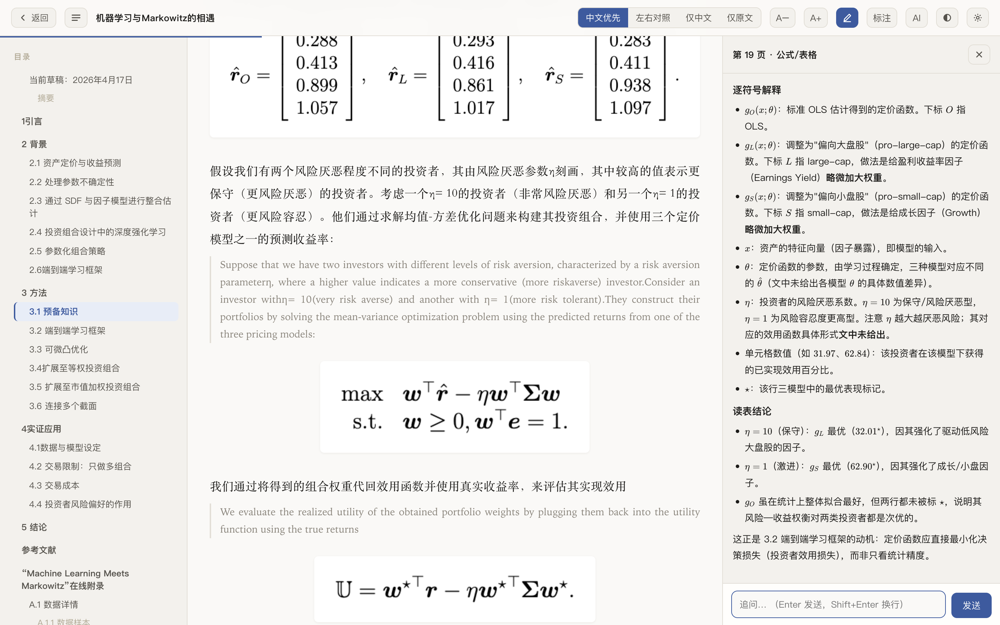
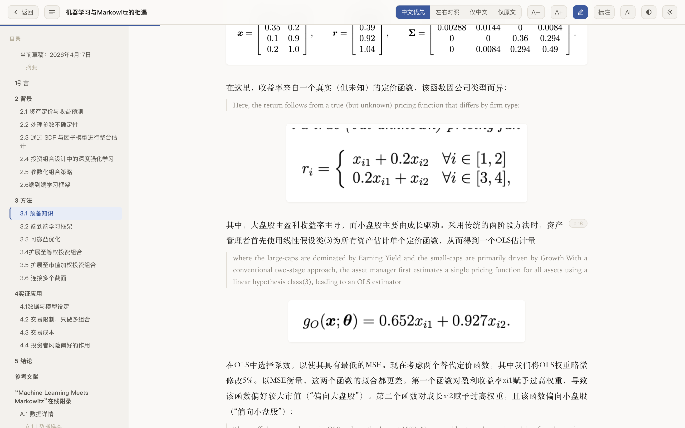
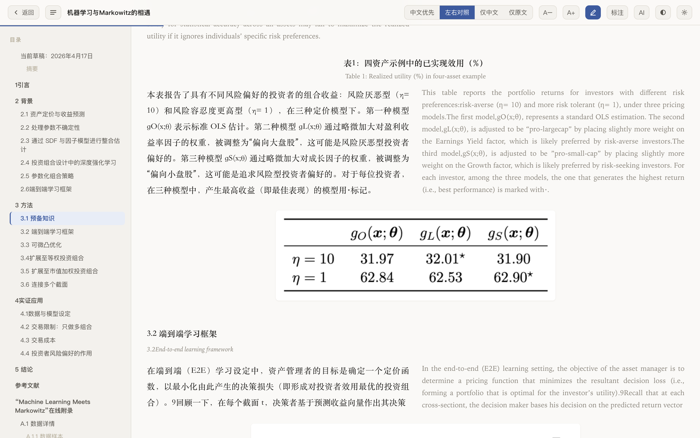
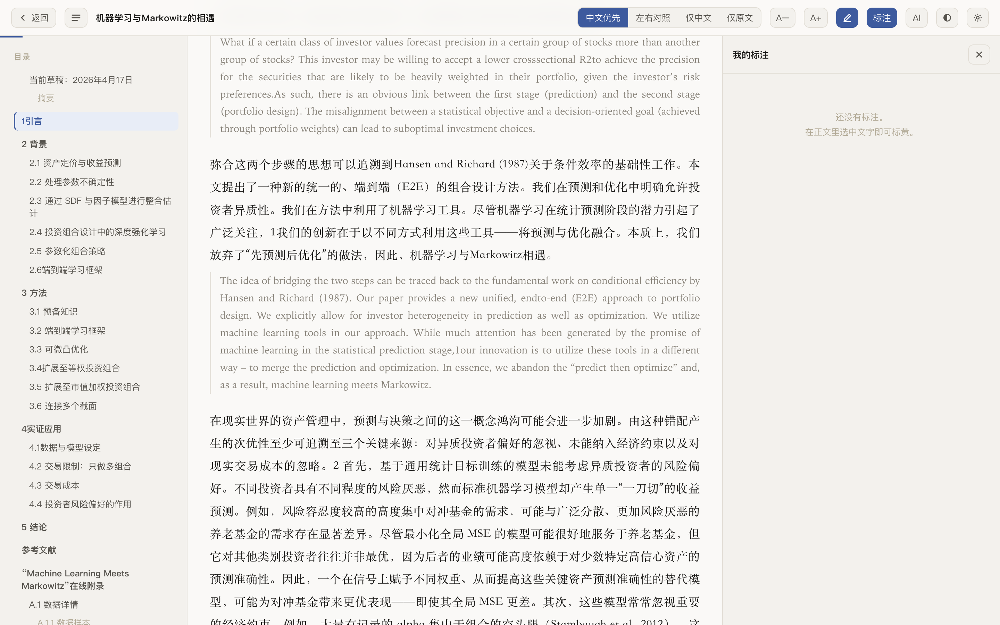
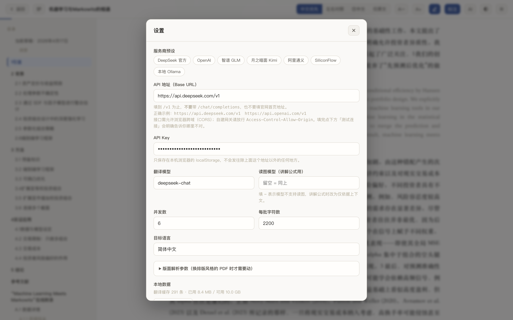
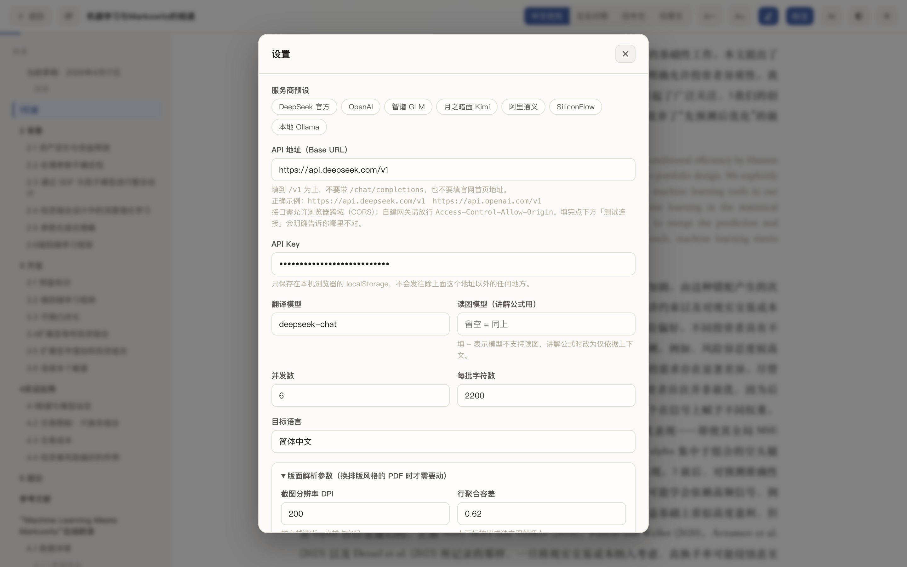
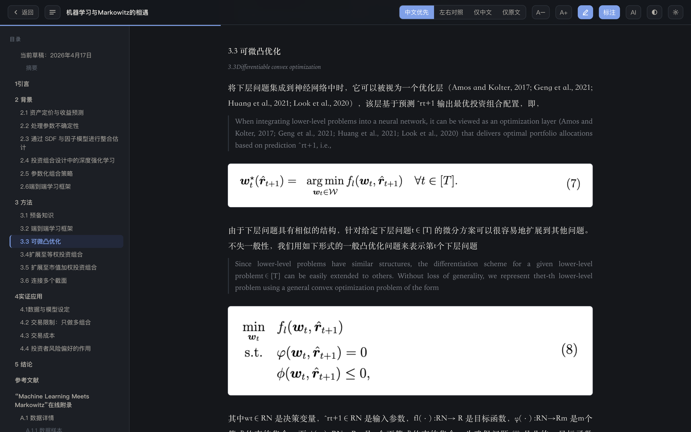

<div align="center">

# paper-lens

**中英对照读论文,公式原样保留,AI 助教就在旁边。**

拖入 PDF,得到一份中英对照的阅读器,每个公式、表格、插图都保持原始排版。点公式让 AI 讲解,划选任意文字继续追问。

全程在浏览器里完成,无后端,无构建,文件不上传。

[English](README.md)



</div>

---

## 为什么做这个

起因是要精读一篇 85 页的金融/机器学习论文,现有方案各有各的问题。

**机器翻译会把数学毁掉。** 这不是质量问题,是结构问题。PDF 里没有"一个公式"这种概念,它只存字形和坐标。把矩阵的文本抽出来是这样:

```
0.2880.4130.8991.057
```

表格更糟:

```
High(H)40.020.61.9443.620.42.14225.819.31.34...
```

任何试图从文本流重建公式的方案都建在沙子上。把这串东西拿去翻译,数学就没了。

**光翻译不解决真正的问题。** 读到一个内层用 KKT 条件求导的双层优化,把周围的散文翻成中文并不能让人看懂,需要有人把符号逐个讲一遍。而这意味着切到聊天窗口、把公式重新敲成 LaTeX、再把刚读过的上下文复述一遍,每次都要来一遍。

**方便的工具想要你的文件。** 上传式服务拿来处理博客文章没问题,但未发表的草稿、客户材料、签了保密协议的东西,不该传出去。

所以:公式以像素形式保留,助教放在正文旁边,文件不离开本机。

## 能做什么

公式、表格、插图按**原始坐标从渲染后的 PDF 裁切**下来嵌回去。零失真,因为压根没有重建这一步。只有正文被翻译。

<table>
<tr>
<td width="50%"></td>
<td width="50%"></td>
</tr>
<tr>
<td align="center"><em>公式就夹在讨论它的两段之间</em></td>
<td align="center"><em>四种视图,这是左右对照</em></td>
</tr>
</table>

### 点公式提问

点任意公式,图片**连同上下文**(最近的章节标题、前后段落的中英文)一起发给模型,所以回答是贴着这篇论文的,不是泛泛而谈。回答经 KaTeX 渲染,你看到的是 $\ell(\theta)=\frac{1}{NT}\sum_{i=1}^{N}\sum_{t=1}^{T}(\cdot)^2$,不是 `1/(NT) Σ...` 这种拼凑。

追问会保留会话,所以"为什么要这样设计"可以直接作为第二轮问。

### 划词标黄



选中文字即高亮,译文和原文都能标。面板按正文顺序列出全部标注,点一条跳回原位并闪烁定位。

标注存的是**块内字符偏移**而非 DOM 位置,所以切换视图、补译、重新渲染之后都还在。

### 用你自己的模型

<table>
<tr>
<td width="50%"></td>
<td width="50%"></td>
</tr>
</table>

任何兼容 OpenAI 格式的接口都行。内置 DeepSeek、OpenAI、智谱 GLM、Kimi、通义、SiliconFlow 和本地 Ollama 的预设。密钥存在 `localStorage`,只发往你填的那一个地址。

版面参数也开放出来了,PDF 排版和默认值对不上时可以调。

### 其他

- **四种视图** — 中文优先、左右对照、仅中文、仅原文
- **文档库**存在 IndexedDB,译文有缓存,重开不花钱
- **可中断** — 翻译中途停下,下次接着译
- **自带术语表** — 70 余条金融/优化术语强制统一
- **深色模式**,`Cmd+P` 直接打印(工具栏自动隐藏)



## 快速开始

```bash
git clone https://github.com/OWNER/paper-lens.git
cd paper-lens
python3 -m http.server 8080
```

打开 <http://localhost:8080>,点右上角**设置**填入 API 地址和密钥,然后把 PDF 拖进来。

> **必须通过 HTTP 打开,不能直接双击 `index.html`。** ES modules 和 pdf.js worker 在 `file://` 下会被同源策略拦住。任何静态服务器都行:`npx serve`、nginx、GitHub Pages。

对接口有两个要求:

1. **CORS 要放行。** 大多数官方 API 都放行。自建网关需要配 `Access-Control-Allow-Origin`。「测试连接」按钮会直接告诉你是不是卡在这里。
2. **讲解公式需要模型能读图。** 模型不支持读图就在「读图模型」里填 `-`,会自动退化成仅凭上下文推断,并如实说明。

## 85 页论文实测

| | |
|---|---|
| 解析 | 11.4 秒(85 页,浏览器内) |
| 翻译 | 约 150 秒(6 路并发) |
| 版面块 | 481 个 — 39 标题 / 200 正文 / 28 表图题 / 32 脚注 / **67 图形** / 115 参考文献 |
| 重新打开 | 秒开(缓存命中) |

解析器与同逻辑的 PyMuPDF 实现做过对照:图形数量完全一致(67 个),待译字符数相差 0.8% 以内。

## 工作原理

```
PDF ──► parser.js ──► 版面块序列 + 裁切图
                          │
                          ├─► translator.js ──► 分批 / 并发 / 缓存
                          ├─► reader.js     ──► 渲染、目录、标注、点图提问
                          └─► ai.js         ──► 上下文组装、流式回答
```

| 文件 | 职责 |
|---|---|
| `js/parser.js` | PDF → 版面块 + 裁图。**最核心** |
| `js/translator.js` | 分批、并发、缓存、失败降级 |
| `js/llm.js` | OpenAI 格式调用层,含流式 |
| `js/ai.js` | 会话状态、上下文组装、公式提示词 |
| `js/reader.js` | 渲染、目录、划词标注 |
| `js/store.js` | IndexedDB — 文档库与翻译缓存 |
| `js/main.js` | 状态机与全部交互 |
| `js/config.js` | 默认配置、服务商预设、版面参数、术语表 |

### 开发笔记

以下都是花了真实时间才找到的:

**公式必须截图,不能重建。** 见上面那串烂掉的矩阵,没有什么巧妙的解析能把它救回来。

**PDF.js 的渲染调度走 `requestAnimationFrame`,而浏览器会冻结后台标签页的 rAF。** 解析中途切走标签页就会卡死。OffscreenCanvas 也救不了,因为冻结的是调度器不是画布。解析期间把 rAF 换成 `setTimeout` 即可,顺带还摘掉了 60fps 的上限。

**把图表连成一体的是矢量线条,而它们不在文本流里。** 坐标轴、折线、分数线、根号、矩阵括号,`getTextContent()` 一个都不返回。只按文本碎片的间距聚类,一张折线图会碎成几条横带(本项目实测有一张碎成 4 块,间隔 66/21/16pt)。解析 `getOperatorList()` 等于重新实现一遍图形状态栈,所以换个思路:**去看渲染出来的像素**。把页面降采样到 72dpi 算一次逐行墨迹投影,两个碎片之间若没有文字却有墨迹,就合并。

> 不要在 200dpi 画布上按区域取 `getImageData`,那会让 85 页从 5 秒涨到 80 秒。降采样后一次性取、且延迟到真正需要时才算,是 11 秒。

**IndexedDB 未命中时返回 `undefined`**,所以 `result !== undefined` 不是有效的"取到值了吗"判断 — 它会把 `IDBRequest` 对象本身当成结果,首次运行时每一块都像是缓存命中。

**正文和参考文献的缩进语义相反。** 段落缩进首行,文献条目悬挂缩进。同一个 x 偏移含义相反,所以分块时必须先从第二行推断当前是哪种排版。

**一个 2pt 的阈值引发了四处回归。** LaTeX 把段落首行缩进到 x=90,而"是否顶格"的判定线是 88。单行段落和项目符号列表 — 恰好是块的最小 x 就等于缩进值的情况 — 全被判成图形截了出来。

**先抽 LaTeX 再跑 Markdown。** `**` 和 `_` 会毫不客气地啃掉 `\frac{}{}` 和 `\sum_{i=1}^{N}`。先把公式存起来,转换完再填回去。

**绝不要给 KaTeX 设 `white-space: normal`。** 它的布局是绝对定位的,一允许折行公式右半截就没了。过宽的公式用 `transform` 缩放。

## 已知限制

- **不支持双栏 PDF。** 版面块按 y 坐标排序,双栏会左右交错。要支持得先按 x 分栏。
- **扫描件需要先 OCR** — 本工具读的是文本层,自身不做 OCR。
- 版面默认值是按 US-Letter 的 LaTeX 论文调的(正文 12pt,x=72)。其他排版可能需要去设置里调一轮。
- 一个已知的观感问题:脚注里的行内分式可能被裁成一条细长横带。

## 参与改进

欢迎提 Issue 和 PR。如果某个 PDF 解析得不好,把它(或其中一页)附上会非常有帮助 — `parser.js` 里几乎每一条规则都来自一个具体的失败案例。

## 许可

MIT。打包的依赖各自保留原许可,见 [`vendor/README.md`](vendor/README.md)。
